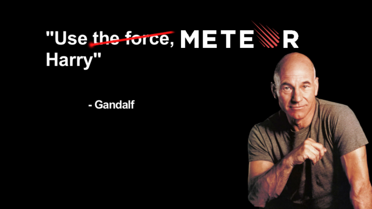

class: center middle

Introduction to 
======================

by

Matyas Albert Nagy

---

Quickstats
==========

--

* It rings a bell

--

* Gave it a try

--

* Yeah! I'm doing it!

---

Agenda
=======

* Intro

--

* What?

--

* Why?

--

* Show it!

--

* Do you even mobile?

--

* Extra

--

* Q&amp;A

---

Intro
=====

* '06 Flash
* '07 Php (Html4 / Ajax / CSS )
* '11 Java (Spring &amp; Flex / JEE &amp; Primefaces)
* '12 Python
* '13 Javascript (Clientside templating / Sass / Less)

---

What is meteor?
===============

--

Javascript based technology stack

--

* mongoDB .logo[]

--

* nodejs .logo[]

--

* client side awesomeness

--

* mml - magical meteor love (hot code push / auto assembly)

--

= Aweseome platform to dev on
---------------------------

---

Principles
==========

* Data on the wire

--

* One language

--

* Database everywhere

--

* Latency compensation

--

* Fullstack reactivity

--

* Embrace the ecosystem

--

* Simplicity equals productivity

---
class: center

Demo
====

--

"Yesterday you said today!" - Shia Labeouf

--

---

What else could you need ?
========================

--

* iron:router

--

* accounts-base / -password / -facebook / -google / -oauth / -ui

--

* less / sass / stylus

--

* react / angular

--

* es2015 support via babel

--

* ... any of the 7256 other packages

---

Mobile
======

--

* Official plugins to package webview based cordova apps

--

* Use DDP (Distributed Data Protocol) in other native apps (iOS, Android, C#, Ruby etc.)

---

Extra
=====

--

* popularity: 393k unique installs

--

* **webstorm** by IDEA

--

* **atmospherejs.com** - package repository

--

* deploy it at **my-awesome-app.meteor.com** or soon in **Galaxy** (work in progress) or any mongodb/nodejs solution Ex. **openshift** (by RedHat)

--

* **velocity.meteor.com** - Jonas Aschenbrenner - Munich

--

* community - **[meetup.com/Meteor-Munich](http://meetup.com/Meteor-Munich)**  (worldwide: 62 - upcoming events)

--

* stackoverflow - ~15k questions

--

* The Book - [discovermeteor.com](http://discovermeteor.com)

--

* Other sources [meteorpedia.com](meteorpedia.com) / [meteorhacks.com](meteorhacks.com) + weekly newsletter / [meteorpodcast.com](meteorpodcast.com) / [meteorpad.com](meteorpad.com)

---
class: middle center

Q &amp; A
=========

---

class: center

Thank you
=========

--

